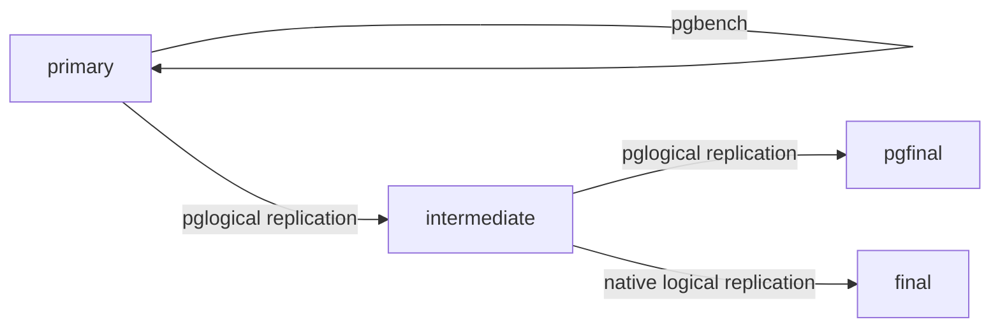

# Cascade Testing with `pglogical`

## Bottom line up front

It seems pglogical subscribers can serve as native logical publishers without major surprises.

## What we're trying to test

Here we're trying to validate whether it's possible to cascade `pglogical` replication to 
native logical replication. According to their docs, `pglogical` can be cascaded by itself
but we may need to use `pglogical` as a source for Cloud SQL and native logical replication
for other consumers (airbyte, datastream)

## Why we're interested in this

Adding logical replication seemed to have an effect on physical replication, and 
the downstream replica's performance seemed to influence this. By cascading, we 
*may* be able to provide some buffer to protect the primary from poorly-behaved
replicas. 

Native logical replication has some limitations `pglogical` is not prone to:
- forwarding truncates
- forwarding DDL operations
- forwarding sequences
- conflict detection

## Architecture

We have four replicas: `primary`, `intermediate`, `pglogical`, and `final`. If this works
correctly, we'll run `pgbench` on the `primary`, which will then replicate to
`intermediate` using `pglogical`, which in turn replicates to `pgfinal` using `pglogical` and to `final` using native logical replication. 

## Running

Set up the hosts with `docker compose up`. Watch the logs and wait for all three
instances to report that postgres is ready to serve traffic. Then run `test.sh`, 
which will set up all the schemas, publications, and subscriptions, then runs 
pgbench for ten minutes.

## Validation

The simplest validation is running something like`select count(*) from pgbench_history;` 
on at least `primary`, `pgfinal`, and `final` and comparing the results. If `pgbench` is still 
running, they'll be close but not exactly the same. Once `pgbench` has stopped for a bit,
they should be identical.

Checking the isolation is what we intend probably looks like:
1. start `pgbench`
1. shut down `final` with `docker compose stop final`
1. run `select catalog_xmin from pg_replication_slots;` on `primary`
1. run `select catalog_xmin from pg_replication_slots;` on `intermediate`
1. wait a while
1. run `select catalog_xmin from pg_replication_slots;` on `primary` again. The number
   should be higher, which shows that:
   - `primary` kept creating data (e.g. `pgbench` is actually writing stuff)
   - `intermediate` kept reading it
   - `primary` does not know `final` is behind
1. run `select catalog_xmin from pg_replication_slots;` on `intermediate` again. The number
   should be the same, which shows that:
   - `intermediate` knows that `final` is not receiving replication.

If the last two steps above behave as expected, we know that failure of a subscriber's subscriber
does not affect a publisher.

## Other lessons learned

`pglogical` seems to self-recover, but somewhat slowly. During testing, I stopped `intermediate`
for a minute or so. After starting it back up, `final` seemed to start receiving writes again
almost immediately, but `pgfinal` took a few minutes.